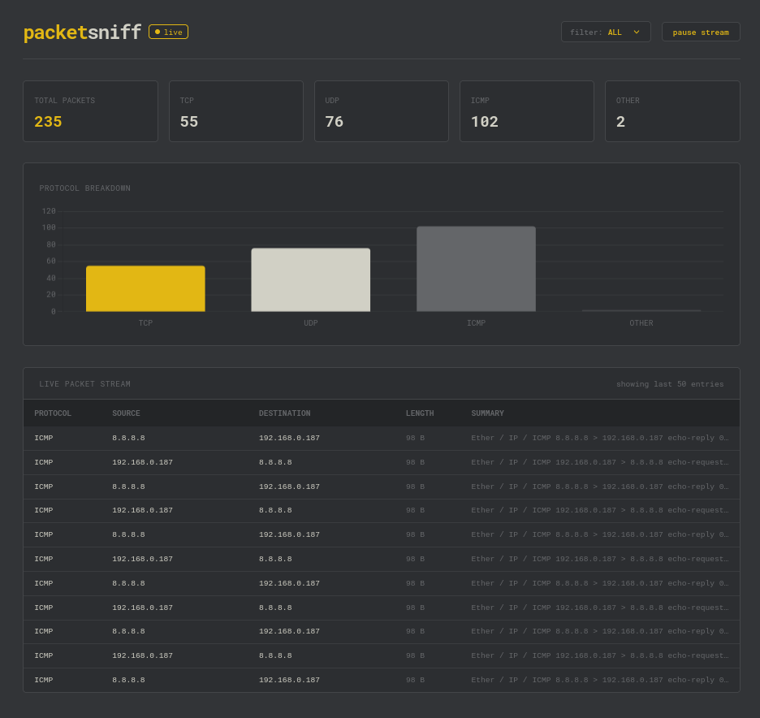

# PacketSniff

PacketSniff is a real-time network packet sniffer and streaming dashboard built with Django Channels, Scapy, and Redis. It captures raw network interface traffic at the socket level and streams parsed frame data to a web application over non-blocking WebSockets.



## Architecture Overview

```text
[ Network Interface ]
        │
        │
        │ (Raw Sockets)
        │
        ▼ 
 [ Scapy Sniffer ] ───(async_to_sync)───► [ Redis / Valkey Channel Layer ]
                                                    │
                                                    │
                                                    ▼
[ Web Dashboard ] ◄──────(WebSocket)──── [ Daphne ASGI Server ]

```

1. **Packet Capture Daemon (`sniffer.py`)**: Runs with administrative privileges to inspect network frames via Scapy, extracting layer data (IP, TCP, UDP, ICMP) and broadcasting JSON payloads.
2. **Channel Layer Broker (Redis)**: Serves as an asynchronous message bus passing packet event dictionaries between the capture daemon and ASGI worker processes.
3. **ASGI Server (Daphne)**: Handles WebSocket lifecycle events (`ws://127.0.0.1:8000/ws/packets/`) and multiplexes packet broadcasts to connected browser sessions.
4. **Frontend Dashboard**: Minimalist single-page interface monitoring packet velocities, protocol distributions via dynamic bar charts, and live stream control filters.


## Tech Stack

* **Language**: Python 3.14
* **Backend Framework**: Django 5.x + Django Channels (ASGI)
* **ASGI Server**: Daphne
* **Packet Engine**: Scapy
* **Message Broker**: Redis / Valkey (RESP2 Protocol)
* **Frontend Engine**: HTML5, Tailwind CSS, Chart.js, Vanilla JavaScript (WebSockets)


## Prerequisites

* Python 3.14 or higher
* Redis or Valkey server running locally on default port `6379`
* Root / Sudo execution privileges (required by Scapy for raw socket binding)


## Installation & Setup

1. Clone the repository:
```bash
git clone [https://github.com/blankInPajamas/PacketSniff.git](https://github.com/blankInPajamas/PacketSniff.git)
cd PacketSniff

```


2. Create and activate a Python virtual environment:
```bash
python -m venv venv
source venv/bin/activate

```


3. Install requirements:
```bash
pip install -r requirements.txt

```


4. Apply initial database migrations:
```bash
python manage.py migrate

```


## Execution

1. **Verify Redis is active**:
```bash
redis-cli ping

```


2. **Start the Daphne ASGI server**:
```bash
make run

```


3. **Start the packet capture daemon** (in a separate terminal):
```bash
make sniff

```


4. Access the web interface at `http://127.0.0.1:8000/`.


## Implementation Progress

* [x] **Phase 1**: Base Django configuration and environment setup.
* [x] **Phase 2**: ASGI routing setup with Django Channels and Redis backend integration.
* [x] **Phase 3**: Integration of Scapy packet parsing loop with async Redis channel layer broadcasting.
* [x] **Phase 4**: Frontend dashboard implementation featuring dynamic protocol statistics, Chart.js breakdown graphs, and stream filters.
* [ ] **Phase 5**: Database persistence using Django ORM, interactive packet inspection modal with hex view, and BPF core sniffer filtering.
* [ ] **Phase 6**: Cross-platform containerization (`docker-compose` orchestration).
